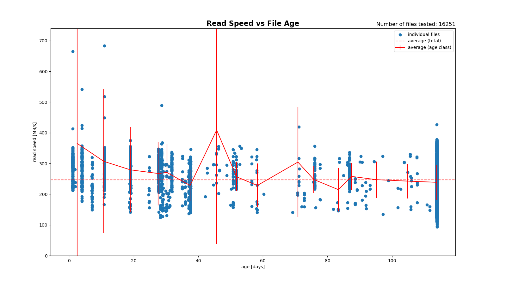

# SSD-Read-Degen-Test
A Simple test program for Linux to detect SSD Read Speed Degeneration Problems

## Problem description
Some SSD have been reported to suffer from read speed degeneration: as files age the read speed may dramatically dropp (e.g. from GB/s to MB/s). This is attributed to leaks in FLASH memory cells which require the SSD controller to performe error correction and multible reads. 

This problem was originally reported some years ago (e.g. Samsung 840) and was subsequently fixed by the SSD manufatures on firmware level by automatically refreshing old data -- at the cost of a reduction the SSD lifetime.

Unfortunately this problem reappears im modern NVME SSDs as FLASH memory durability tends to decrease in recent devices. 

Popular SSD performance test tools are unable to detect this phenomena because they operate on freshly created files.

There is a shareware tool for Windows to test for this phenomena, whereas no such tool seems to exist for Linux. Therefore I wrote my own tool -- not as shiny as the Windows tool but fully capable of detecting the problem (I hope). At the moment it is command line tool that recordes the result in a text file. The entries are sorted by file age (young -> old). A python script is provide for graphical display of the results.

## Programs / Tools
- degentest:        collects read speed data (writes output to stdout or file)
- plotspeedtest.py: plot script for data for degentest 

## How degentest works
This program reads files using low level I/O and calculates the read speed. It records age, file size and read speed for each file. A minimum file size can be specified to aviod artefacts when reading small files. The list of files to be tested can be specified by options passed to GNU find program.

## Prerequisites
- GNU find (or find that suppots -print0 option)
- gcc/g++ and cmake for building the executable
- python and python-matplotlib package for plot script

## Building the program
Run the build script in the source directory:

    ./build.sh
This will place the executable **degentest** in the project directory.

## Runnig the degentest
Usage information output by the degentest:

    $ ./degentest --help
    degentest [options]
    Options:
    -b | --brief          report errors only
    -f | --fopt           options to find command (default '-xdev -type f')
    -h | --help           Print this help
    -v | --verbose        verbose output
    -V | --version        Print the version number
    -m | --minsize <size> discard smaller files
                          use size suffices 'cbkMG' as defined by GNU find program
    -o | --output <fnam>  write output to file (default stdout)
    -p | --path           Path to start at, can be called multipe times

    usage example:
    degentest-v -p / -p /home  -m 1M -o res.dat -f "-xdev -type f -maxdepth 1"
    scan directory tree / and /home, test only file  >1MB, write output to res.dat
    call find with options "-xdev -type f -maxdepth 1"

## Example
Suppose our Linux installation has three separate file systems mounted as /, /home and /media. We want to scan all files greater then 1MB and write the output to readspeed.dat:

    $ ./degentest -p / -p /home -p /media -m 1M -o readspeed.dat
Now we want to plot the results:

    $ ./plotspeedtest.py readspeed.dat
If we call plotspeedtest.py without filename a file picker lets us select the file we want to plot.

## Output File Format
The output file is a simple ASCII file the file format is as follows:

    # Age[day]	  Size[MB]	Time[s]	Speed[MB/s]		Filename
       0.7	       2.2	    7.27e-04	    3087.2		/usr/bin/shiboken6
       43.8	       1.0	    1.26e-04	    8157.4		/usr/bin/gpg

Note: Typical a read speed on this system is ~2.5GB/s to ~ ~3.5GB/s for large, recently created files. The first file shows a realistic read speed (~3GB/s), the second file's read speed (~8GB/s) is distorted by caching effect. Outliners in both dirctions are likely and do not proof SSD read rate degeneration.

## Limitations 
There is no reliable method to determine the **true** file age (= time of last write to the file). The mtime (time of last content modification) can be set to any time and this is typically done for installed software (e.g. stuff in /usr, see the example above with /usr/bin/lftp which was installed in 12/2022). These files may be younger as indicated by mtime. Most filesystems support btime (birthtime, time of file creation). If btime is younger than mtime, the program uses btime, otherwise mtime. This should solve the problem in **most** cases. However if mtime is set to some time in after the last write operation we are doomed. 

## Grafical Display of the Results
For graphical display a python script is provided. Since read speed will vary for individual files plotting an average read speed versus file age (e.g. in steps of months) should give a reliable trend. The plot constist of a scatter plot of the read speed of individual files and an averaged trend. 

## Interpreting the results
Variations of read speeds are to be exspected in a multitasking environment. File caching can cause unrealistic high read speeds for some files. Concurring processes can cause low read speeds -- test on a idle system or from a live system. If the average read speed drops with increasing file age a read speed degeneration is likely.

## Fixing the Read Speed Degeneration
If a firmware update is not provide by the manufacturer re-writing old files on a regular basis has to be performed by the user. This is out of the scope of this program.

## Sample Results
The plot below is from a SATA SSD without read speed degeneration after 5 month. The average read spead does not dropp off with file age.

